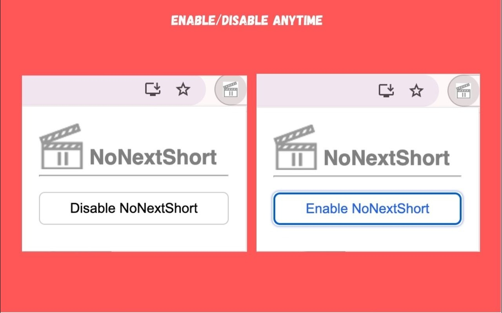
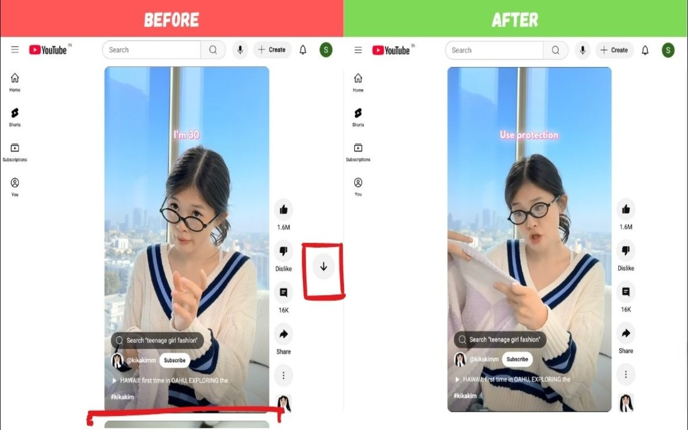

# NoNextShort

**Stop Infinite YouTube Shorts**

NoNextShort is a productivity tool designed to help you regain control over your YouTube experience by preventing the "infinite scroll trap" on YouTube Shorts.

## Features

- **Disable Autoplay:** Stop YouTube Shorts from automatically moving to the next video.
- **Stop Infinite Scrolling:** Break the loop of endless content consumption.
- **Mindful Browsing:** Watch the specific video you choose without getting pulled into a rabbit hole.
- **Lightweight & Privacy-Focused:** Minimal impact on browser performance and no tracking.
- **Easy Toggle:** Simple interface to turn the functionality on or off as needed.

## Installation

1. Clone this repository to your local machine.
2. Open Chrome and navigate to `chrome://extensions/`.
3. Enable **Developer mode** in the top right corner.
4. Click **Load unpacked** in the top left corner.
5. Select the directory where you cloned this repository.

## Usage

Once installed, simply click the NoNextShort icon in your browser's toolbar to toggle the extension on or off. When enabled, your YouTube Shorts experience will be restricted, allowing you to focus on the content you intentionally selected.

## Screenshots

*(Insert screenshots here to showcase the interface)*
- 
- 

## Contributing

Contributions are welcome! Please feel free to submit a Pull Request.

## License

This project is licensed under the MIT License - see the [LICENSE](LICENSE) file for details.
